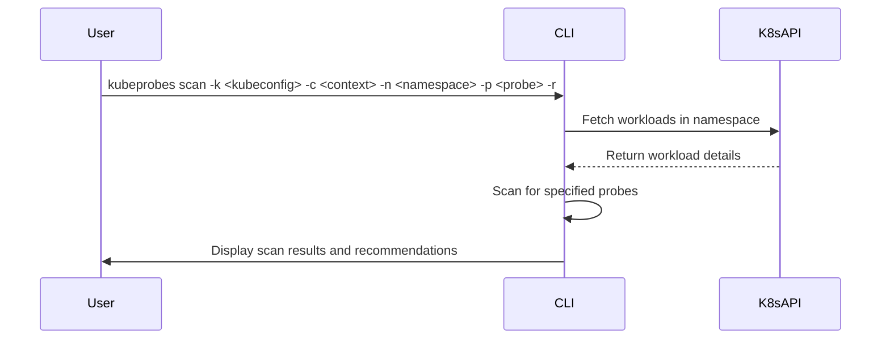

# Kubeprobes

[](https://www.bestpractices.dev/projects/10573)

Uma ferramenta CLI para verificar probes do Kubernetes em seus workloads.

## Funcionalidades

- Verifica liveness, readiness e startup probes
- Suporta múltiplos namespaces
- Fornece recomendações de configuração
- Integração com diferentes contextos do Kubernetes

## Instalação

### Binários Pré-compilados

Baixe o binário apropriado para seu sistema da [página de releases](https://github.com/nataliagranato/kubeprobes/releases).

### Compilando do Código Fonte

```bash
git clone https://github.com/nataliagranato/kubeprobes.git
cd kubeprobes/src
go build -o kubeprobes
```

## Uso

```bash
# Verificar todos os tipos de probes no namespace padrão
kubeprobes scan

# Verificar um tipo específico de probe com recomendações
kubeprobes scan -p liveness -r

# Verificar em um namespace específico
kubeprobes scan -n meu-namespace

# Usar um kubeconfig e contexto específicos
kubeprobes scan -k /path/to/kubeconfig -c meu-contexto
```

## Segurança

Este projeto segue as melhores práticas de segurança do OpenSSF. Para reportar uma vulnerabilidade, por favor consulte nosso [SECURITY.md](SECURITY.md).

## Contribuindo

Contribuições são bem-vindas! Por favor, leia nosso [CONTRIBUTING.md](CONTRIBUTING.md) para detalhes sobre nosso código de conduta e o processo para enviar pull requests.

## Licença

Este projeto está licenciado sob a licença MIT - veja o arquivo [LICENSE](LICENSE) para detalhes.

## Changelog

Veja [CHANGELOG.md](CHANGELOG.md) para uma lista de mudanças.



## Requisitos

- Go 1.13 ou superior
- kubectl
- Um cluster Kubernetes acessível

## Instalação

1. Clone o repositório:

```bash
https://github.com/Tech-Preta/kubeprobes.git
```

2. Entre no diretório do projeto:

```bash
cd kubeprobes
```

3. Compile o código fonte:

```bash
cd src
go build -o kubeprobes
```

4. Mova o binário para o diretório /usr/local/bin:

```bash
sudo mv kubeprobes /usr/local/bin
```

5. Verifique se a instalação foi bem sucedida:

```bash
kubeprobes --help
```

## Uso

### Comandos Disponíveis

- `scan`: Escaneia workloads do Kubernetes em busca de probes.
  
  Exemplo de uso:

```bash

kubeprobes scan -k <caminho-para-o-kubeconfig> -c <contexto-kubeconfig> -n <namespace> -p <tipo-de-probe> -r
```

### Flags

- `-k, --kubeconfig`: Caminho para o arquivo kubeconfig.
- `-c, --kubeContext`: Contexto do Kubernetes.
- `-n, --namespace`: Namespace do Kubernetes.
- `-p, --probe-type`: Tipo de probe para escanear (liveness, readiness, startup).
- `-r, --recommendation`: Mostrar recomendações para sondas ausentes.

## Contribuições

Contribuições são bem-vindas! Sinta-se à vontade para abrir um issue ou enviar um pull request.
