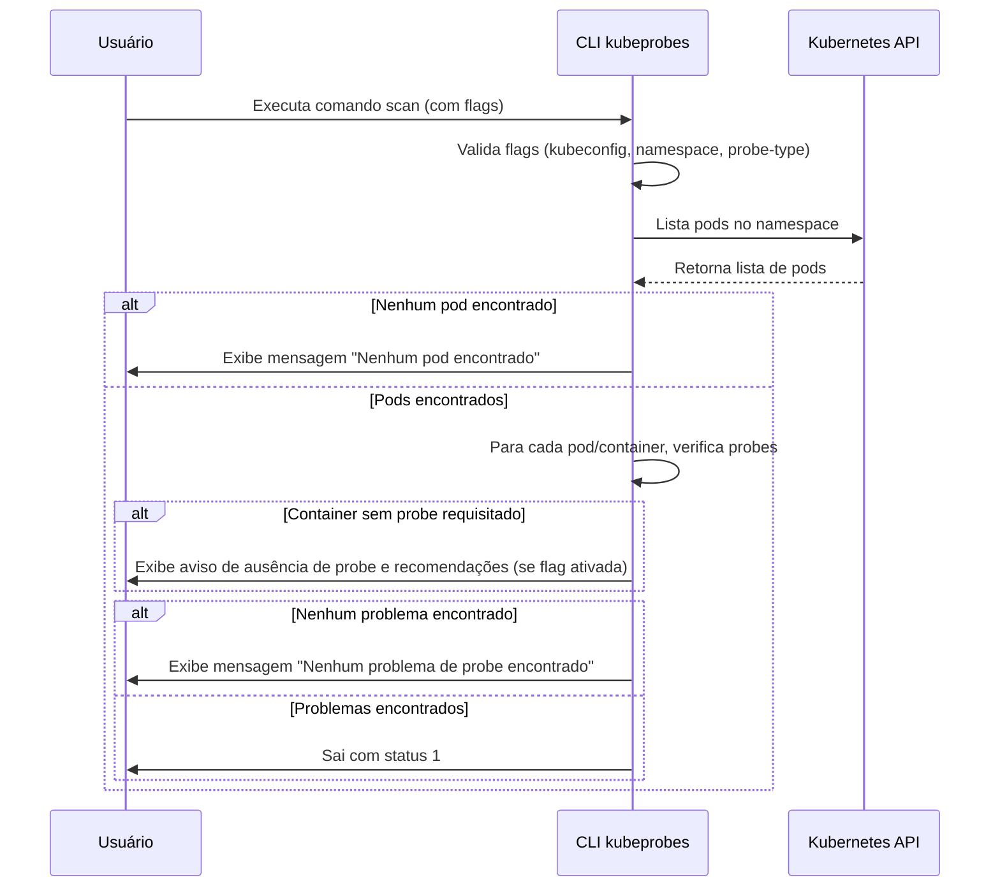

# Kubeprobes

[](https://www.bestpractices.dev/projects/10573)

Uma ferramenta CLI para verificar probes do Kubernetes em seus workloads.

## Funcionalidades

- Verifica liveness, readiness e startup probes
- Suporta múltiplos namespaces
- Fornece recomendações de configuração
- Integração com diferentes contextos do Kubernetes

## Requisitos

- **Go**: versão 1.24.5 ou superior
- **Kubernetes**: versão 1.28+ (cliente v0.31.0)
- **Sistema**: Linux, macOS, ou Windows

## Instalação

> Para uso com Docker, consulte a [documentação Docker](docs/docker.md).

### Binários Pré-compilados

Baixe o binário apropriado para seu sistema da [página de releases](https://github.com/Tech-Preta/kubeprobes/releases).

### Compilando do Código Fonte

1. Clone o repositório:

```bash
git clone https://github.com/Tech-Preta/kubeprobes.git
```

2. Entre no diretório do projeto:

```bash
cd kubeprobes
```

3. Compile o código fonte:

```bash
make build
```

4. (Opcional) Instale o binário no sistema:

```bash
make install
```

5. Verifique se a instalação foi bem sucedida:

```bash
kubeprobes --help
```

## Uso

### Exemplos Básicos

```bash
# Verificar todos os tipos de probes no namespace padrão
kubeprobes scan

# Verificar um tipo específico de probe com recomendações
kubeprobes scan -p liveness -r

# Verificar em um namespace específico
kubeprobes scan -n meu-namespace

# Verificar em todos os namespaces
kubeprobes scan --all-namespaces

# Usar um kubeconfig e contexto específicos
kubeprobes scan -k /path/to/kubeconfig -c meu-contexto
```

### Exemplos com Diferentes Formatos de Saída

```bash
# Saída em formato JSON
kubeprobes scan -o json

# Saída em formato YAML
kubeprobes scan -o yaml

# Saída em formato texto (padrão) com recomendações
kubeprobes scan -o text -r
```

### Exemplos Avançados

```bash
# Verificar liveness probes em todos os namespaces com saída JSON
kubeprobes scan -A -p liveness -o json

# Verificar todos os probes com falha em avisos (exit code 1)
kubeprobes scan --fail-on-warn

# Exemplo completo com todas as opções
kubeprobes scan -k ~/.kube/config -c production -A -p readiness -r -o yaml -f

# Verificar namespace específico com recomendações e falha em avisos
kubeprobes scan -n kube-system -r -f
```

### Códigos de saída
- 0: Nenhum problema de probe encontrado
- 1: Problemas de probe encontrados (sempre quando há avisos, ou quando usado `--fail-on-warn`)

### Formatos de Saída

#### Texto (padrão)
```
[WARNING] Pod default/my-app-123 (container: app) is missing liveness probe
  Recommendation: Add a liveness probe to ensure the container is running correctly.
```

#### JSON
```json
{
  "issues": [
    {
      "namespace": "default",
      "podName": "my-app-123",
      "containerName": "app",
      "probeType": "liveness",
      "message": "missing liveness probe",
      "recommendation": "Add a liveness probe to ensure the container is running correctly."
    }
  ],
  "summary": "Found 1 probe issues in default",
  "namespace": "default",
  "exitCode": 0
}
```

#### YAML
```yaml
issues:
  - namespace: default
    podName: my-app-123
    containerName: app
    probeType: liveness
    message: missing liveness probe
    recommendation: Add a liveness probe to ensure the container is running correctly.
summary: Found 1 probe issues in default
namespace: default
exitCode: 0
```

### Comandos Disponíveis
- `scan`: Escaneia workloads do Kubernetes em busca de probes.

### Flags

| Flag | Short | Description | Default | Examples |
|------|-------|-------------|---------|----------|
| `--kubeconfig` | `-k` | Path to the kubeconfig file. If not provided, uses default kubeconfig location | | `-k ~/.kube/config` |
| `--kubeContext` | `-c` | Kubernetes context to use. If not provided, uses current context | | `-c production` |
| `--namespace` | `-n` | Kubernetes namespace to scan. Use --all-namespaces to scan all namespaces | `default` | `-n kube-system` |
| `--all-namespaces` | `-A` | Scan all namespaces instead of a specific namespace | `false` | `-A` |
| `--probe-type` | `-p` | Type of probe to scan for: liveness, readiness, startup. If not provided, scans all types | | `-p liveness` |
| `--recommendation` | `-r` | Show detailed recommendations for missing probes | `false` | `-r` |
| `--output` | `-o` | Output format: text, json, or yaml | `text` | `-o json` |
| `--fail-on-warn` | `-f` | Exit with code 1 if warnings are found (treats warnings as failures) | `false` | `-f` |

## Auto-completion

O kubeprobes oferece suporte a auto-completion para bash, zsh, fish e PowerShell.

> Para instruções detalhadas de instalação e configuração, consulte a [documentação de auto-completion](docs/completion.md).

### Bash

Para carregar auto-completion na sua sessão atual:

```bash
source <(kubeprobes completion bash)
```

Para carregar auto-completion permanentemente:

```bash
# Linux
kubeprobes completion bash > /etc/bash_completion.d/kubeprobes

# macOS
kubeprobes completion bash > $(brew --prefix)/etc/bash_completion.d/kubeprobes
```

### Zsh

Para carregar auto-completion na sua sessão atual:

```bash
source <(kubeprobes completion zsh)
```

Para carregar auto-completion permanentemente:

```bash
# Linux
kubeprobes completion zsh > "${fpath[1]}/_kubeprobes"

# macOS
kubeprobes completion zsh > $(brew --prefix)/share/zsh/site-functions/_kubeprobes
```

### Fish

Para carregar auto-completion na sua sessão atual:

```bash
kubeprobes completion fish | source
```

Para carregar auto-completion permanentemente:

```bash
kubeprobes completion fish > ~/.config/fish/completions/kubeprobes.fish
```

### PowerShell

Para carregar auto-completion na sua sessão atual:

```powershell
kubeprobes completion powershell | Out-String | Invoke-Expression
```

Para carregar auto-completion permanentemente, adicione a saída do comando acima ao seu perfil do PowerShell.

## Segurança

Este projeto segue as melhores práticas de segurança do OpenSSF. Para reportar uma vulnerabilidade, por favor consulte nosso [SECURITY.md](SECURITY.md).

## Releases

Este projeto utiliza um processo automatizado de releases através do GitHub Actions e GoReleaser.

### Como Funciona

- **Criação de Release**: Quando uma nova tag com formato `v*` (ex: `v1.0.0`) é criada e enviada para o repositório, o workflow de release é automaticamente executado.
- **Artefatos Gerados**: O processo gera binários para múltiplas plataformas (Linux, macOS, Windows) e arquiteturas (amd64, arm64).
- **Distribuição**: Os binários são automaticamente disponibilizados na [página de releases](https://github.com/Tech-Preta/kubeprobes/releases) do GitHub.

### Para Criar uma Nova Release

```bash
# Crie e envie uma nova tag
git tag v1.0.0
git push origin v1.0.0
```

O processo de release será executado automaticamente e estará disponível em alguns minutos.

## Contribuindo

Contribuições são bem-vindas! Por favor, leia nosso [CONTRIBUTING.md](CONTRIBUTING.md) para detalhes sobre nosso código de conduta e o processo para enviar pull requests.

## Licença

Este projeto está licenciado sob a licença MIT - veja o arquivo [LICENSE](LICENSE) para detalhes.

## Changelog

Veja [CHANGELOG.md](CHANGELOG.md) para uma lista de mudanças.


