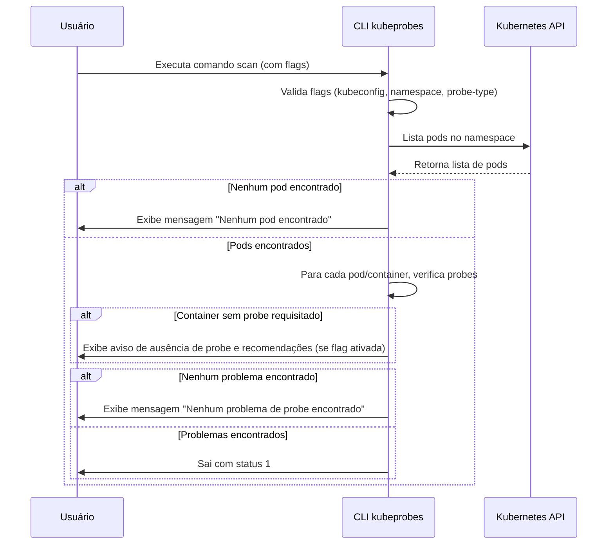

# Kubeprobes

[](https://www.bestpractices.dev/projects/10573)

Uma ferramenta CLI para verificar probes do Kubernetes em seus workloads.

## Funcionalidades

- Verifica liveness, readiness e startup probes
- Suporta múltiplos namespaces
- Fornece recomendações de configuração
- Integração com diferentes contextos do Kubernetes

## Requisitos

- **Go**: versão 1.24.5 ou superior
- **Kubernetes**: versão 1.28+ (cliente v0.31.0)
- **Sistema**: Linux, macOS, ou Windows

## Instalação

> Para uso com Docker, consulte a [documentação Docker](docs/docker.md).

### Binários Pré-compilados

Baixe o binário apropriado para seu sistema da [página de releases](https://github.com/Tech-Preta/kubeprobes/releases).

### Compilando do Código Fonte

1. Clone o repositório:

```bash
git clone https://github.com/Tech-Preta/kubeprobes.git
```

2. Entre no diretório do projeto:

```bash
cd kubeprobes
```

3. Compile o código fonte:

```bash
make build
```

4. (Opcional) Instale o binário no sistema:

```bash
make install
```

5. Verifique se a instalação foi bem sucedida:

```bash
kubeprobes --help
```

## Uso

O kubeprobes oferece diferentes subcomandos para facilitar o uso e organização das tarefas:

### Comando Scan

```bash
# Verificar todos os tipos de probes no namespace padrão
kubeprobes scan

# Verificar um tipo específico de probe com recomendações
kubeprobes scan --probe-type liveness --recommendation

# Verificar em um namespace específico
kubeprobes scan --namespace meu-namespace

# Usar um kubeconfig e contexto específicos
kubeprobes scan --kubeconfig /path/to/kubeconfig --kubeContext meu-contexto

# Exemplo completo com todas as opções:
kubeprobes scan --kubeconfig <caminho-para-o-kubeconfig> --kubeContext <contexto-kubeconfig> --namespace <namespace> --probe-type <tipo-de-probe> --recommendation
```

### Comando Version

```bash
# Mostrar informações de versão detalhadas
kubeprobes version

# Mostrar apenas a versão (útil para scripts)
kubeprobes version --output=short

# Mostrar informações em formato JSON
kubeprobes version --output=json
```

### Comando Completion

```bash
# Gerar script de autocompletion para bash
kubeprobes completion bash

# Gerar script de autocompletion para zsh
kubeprobes completion zsh

# Ver ajuda sobre completion
kubeprobes completion --help
```

### Códigos de saída
- 0: No probe issues found (Nenhum problema de probe encontrado)
- 1: Probe issues detected (Problemas de probe encontrados)

### Comandos Disponíveis

- `scan`: Escaneia workloads do Kubernetes em busca de probes
- `version`: Exibe informações de versão do kubeprobes  
- `completion`: Gera scripts de autocompletion para diferentes shells

### Subcomando Scan - Flags

- `-k, --kubeconfig`: Caminho para o arquivo kubeconfig (padrão: $KUBECONFIG ou ~/.kube/config)
- `-c, --kubeContext`: Contexto do Kubernetes para usar (padrão: contexto atual)
- `-n, --namespace`: Namespace do Kubernetes para escanear (padrão: default)
- `-p, --probe-type`: Tipo de probe para escanear: liveness, readiness, ou startup (padrão: todos os tipos)
- `-r, --recommendation`: Mostrar recomendações acionáveis para probes ausentes

### Subcomando Version - Flags

- `-o, --output`: Formato de saída: default, short, ou json

## Desenvolvimento

### Executando Testes

Este projeto inclui testes unitários abrangentes para garantir a qualidade do código e evitar regressões.

#### Executar todos os testes:

```bash
make test
```

#### Executar testes com cobertura:

```bash
go test -coverprofile=coverage.out ./...
go tool cover -html=coverage.out
```

#### Executar testes de um pacote específico:

```bash
# Testes do scanner
go test -v ./internal/scanner/

# Testes do cliente Kubernetes
go test -v ./pkg/kubernetes/

# Testes da CLI
go test -v ./internal/cli/
```

#### Executar testes em modo verboso:

```bash
go test -v ./...
```

### Estrutura dos Testes

Os testes seguem as convenções do Go e estão organizados em arquivos `*_test.go` ao lado do código fonte:

- `internal/cli/*_test.go` - Testes para comandos da CLI
- `internal/scanner/*_test.go` - Testes para lógica de escaneamento
- `pkg/kubernetes/*_test.go` - Testes para cliente Kubernetes
- `cmd/kubeprobes/*_test.go` - Testes para função main

### Cobertura de Testes

O projeto mantém uma cobertura de testes superior a 75%, incluindo:

- **Cenários de sucesso**: Entradas válidas, diferentes tipos de probe, várias configurações
- **Cenários de erro**: Configurações inválidas, erros de rede, falhas da API
- **Casos extremos**: Namespaces vazios, probes ausentes, grandes conjuntos de dados
- **Dependências mockadas**: Chamadas da API Kubernetes para evitar necessidade de cluster

## Auto-completion

O kubeprobes oferece suporte a auto-completion para bash, zsh, fish e PowerShell.

> Para instruções detalhadas de instalação e configuração, consulte a [documentação de auto-completion](docs/completion.md).

### Bash

Para carregar auto-completion na sua sessão atual:

```bash
source <(kubeprobes completion bash)
```

Para carregar auto-completion permanentemente:

```bash
# Linux
kubeprobes completion bash > /etc/bash_completion.d/kubeprobes

# macOS
kubeprobes completion bash > $(brew --prefix)/etc/bash_completion.d/kubeprobes
```

### Zsh

Para carregar auto-completion na sua sessão atual:

```bash
source <(kubeprobes completion zsh)
```

Para carregar auto-completion permanentemente:

```bash
# Linux
kubeprobes completion zsh > "${fpath[1]}/_kubeprobes"

# macOS
kubeprobes completion zsh > $(brew --prefix)/share/zsh/site-functions/_kubeprobes
```

### Fish

Para carregar auto-completion na sua sessão atual:

```bash
kubeprobes completion fish | source
```

Para carregar auto-completion permanentemente:

```bash
kubeprobes completion fish > ~/.config/fish/completions/kubeprobes.fish
```

### PowerShell

Para carregar auto-completion na sua sessão atual:

```powershell
kubeprobes completion powershell | Out-String | Invoke-Expression
```

Para carregar auto-completion permanentemente, adicione a saída do comando acima ao seu perfil do PowerShell.

## Segurança

Este projeto segue as melhores práticas de segurança do OpenSSF. Para reportar uma vulnerabilidade, por favor consulte nosso [SECURITY.md](SECURITY.md).

## Releases

Este projeto utiliza um processo automatizado de releases através do GitHub Actions e GoReleaser.

### Como Funciona

- **Criação de Release**: Quando uma nova tag com formato `v*` (ex: `v1.0.0`) é criada e enviada para o repositório, o workflow de release é automaticamente executado.
- **Artefatos Gerados**: O processo gera binários para múltiplas plataformas (Linux, macOS, Windows) e arquiteturas (amd64, arm64).
- **Distribuição**: Os binários são automaticamente disponibilizados na [página de releases](https://github.com/Tech-Preta/kubeprobes/releases) do GitHub.

### Para Criar uma Nova Release

```bash
# Crie e envie uma nova tag
git tag v1.0.0
git push origin v1.0.0
```

O processo de release será executado automaticamente e estará disponível em alguns minutos.

## Contribuindo

Contribuições são bem-vindas! Por favor, leia nosso [CONTRIBUTING.md](CONTRIBUTING.md) para detalhes sobre nosso código de conduta e o processo para enviar pull requests.

## Licença

Este projeto está licenciado sob a licença MIT - veja o arquivo [LICENSE](LICENSE) para detalhes.

## Changelog

Veja [CHANGELOG.md](CHANGELOG.md) para uma lista de mudanças.


